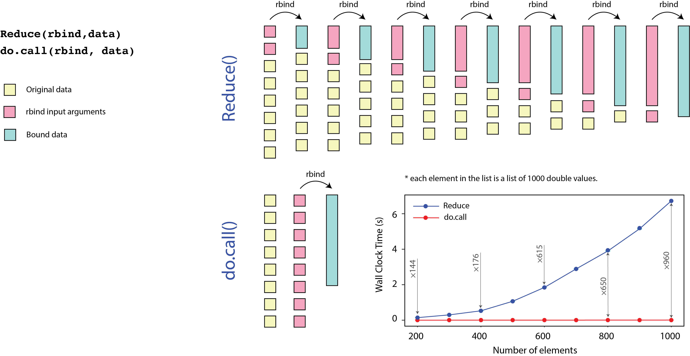

```{r setup, include=FALSE}
knitr::opts_chunk$set(echo = TRUE)
```

### Install libraries

Run this on the console [do not run in your markdown file],
```{r, echo=TRUE, eval=FALSE}
pkgs_list = c("devtools", "datasets", "profvis", "ggplot2movies",
              "R.utils", "dplyr", "pryr", "Matrix", "microbenchmark", 
              "parallel", "Rcpp", 'ggplot2', 'memoise', 'cachem')
new_pkgs = pkgs_list[!(pkgs_list %in% installed.packages()[,"Package"])]
if(length(new_pkgs)) install.packages(new_pkgs)
```


### References
- [C. Gillespie, R. Lovelace, "Efficient R Programming: A Practical Guide to Smarter Programming"](https://www.oreilly.com/library/view/efficient-r-programming/9781491950777/)
- [E. McCallum, S. Weston, "Parallel" R](https://www.oreilly.com/library/view/parallel-r/9781449317850)
- [Large Data Processing in R Workshop by Naeem Khoshnevis](https://github.com/HarvardRC/Large_Data_Processing_R)

### Section 01 ::  R Profiling with `RPROF` function

Before any code optimization, try to find the bottlenecks. One way is to use `Rprof()` function and it offers less insight compared to `profvis()` function,

```{r, echo=TRUE, eval=FALSE}
library(datasets)

utils::Rprof(tmp <- tempfile())

iris <- iris
plot(iris)
print(iris[,1])


utils::Rprof(NULL)
utils::summaryRprof(tmp)
unlink(tmp)
```

What is the difference between `$by.self` and `$by.total` in the output? Also `self.time` and `total.time`.

- `$sample.interval`: interval at which the profiler samples the execution stack.
- `$sampling.time`: total time of the profiling session.

Read more about `Rprof()` function [here](https://www.rdocumentation.org/packages/utils/versions/3.6.2/topics/summaryRprof).


### Section 02 ::  R Profiling with `PROFVIS` function

Please note that RStudio uses same `profvis` library to profile your code. In the following example, we load movies database and plot rating over year for comedy movies.

```{r, echo=TRUE, eval=FALSE}
library("profvis")
library("ggplot2movies")

profvis({
  
  data(movies, package = "ggplot2movies") # Load data
  movies = movies[movies$Comedy == 1,]
  plot(movies$year, movies$rating)
  model = loess(rating ~ year, data = movies) # loess regression line
  j = order(movies$year)
  lines(movies$year[j], model$fitted[j]) # Add line to the plot

  })
```

Read more about `profvis()` function [here](https://www.rdocumentation.org/packages/profvis/versions/0.3.6/topics/profvis).

### Section 03 ::  Simulate monopoly game

In this section, we utilize `profvis` lib to profile the monopoly game code. This lib points out the bottlenecks in the code,

```{r, echo=TRUE, eval=FALSE}
#' Moving square on a Monopoly board
#' 
#' @param current The current square. Number between 1 and 40.
#' This function calculates where you will land on your next move.
#' 
#' @export
library(profvis)

profvis({
move_square = function(current) {
  df = data.frame(d1 = sample(seq(1, 6), 3, replace = TRUE),
                  d2 = sample(seq(1, 6), 3, replace = TRUE))
  
  df$Total = apply(df, 1, sum)
  df$IsDouble = df$d1 == df$d2
  
  if (df$IsDouble[1] & df$IsDouble[2] & df$IsDouble[3]) {
    current = 11#Go To Jail
  } else if (df$IsDouble[1] & df$IsDouble[2]) {
    current = current + sum(df$Total[1:3])
  } else if (df$IsDouble[1]) {
    current = current + sum(df$Total[1:2])
  } else {
    current = current + df$Total[1]
  }
  return(current)
}

##Helper function to avoid code replication
check_state = function(current) {
  if (current > 40) {
    current = current - 40
  } else if (current < 1) {
    current = current + 40
  }
  return(current)
}
update_state_vector = function(current, move, landings) {
  if (move != current) {
    landings[current] = landings[current] + 1
  }
  return(landings)
}
community_chest = function(current) {
  u = runif(1)
  goto = current#Default. Do nothing
  if (u < 1 / 16) {
    goto = 1#Go
  } else if (u < 2 / 16) {
    goto = 11#Jail
  } else if (u < 3 / 16) {
    goto = 2#Old Kent Rd
  } else if (u < 4 / 16) {
    goto = chance(current)
  }
  return(goto)
}

#' @importFrom stats runif
chance = function(current) {
  u = runif(1)
  goto = current#Default. Do nothing
  if (u < 1 / 16) {
    goto = 1#Go
  } else if (u < 2 / 16) {
    goto = 25#Tra Square
  } else if (u < 3 / 16) {
    goto = 12#Pall Mall
  } else if (u < 4 / 16) {
    goto = 11#Jail
  } else if (u < 5 / 16) {
    goto = 16#Mary' Stat
  } else if (u < 6 / 16) {
    goto = 40#Mayfair
  } else if (u < 7 / 16) {
    goto = check_state(current - 3) #Must check, since goto maybe negative!
  } else if (u < 8 / 16) {
    if (current > 29  | current < 13) {
      goto = 13
    } else {
      goto = 29
    }
  }
  return(goto)
}


#' Monte Carlo Simulation of Monopoly
#'
#' An R function for simulating the game of Monopoly
#' @param no_of_turns How many dice rolls should we take
#' @export
simulate_monopoly = function(no_of_turns) {
  landings = numeric(40)
  ##Start GO
  current = 1
  for (i in 1:no_of_turns) {
    current = move_square(current)
    current = check_state(current)
    landings = update_state_vector(current,-1, landings)
    
    if (current == 8 | current == 23 | current == 37) {
      #Chance
      move = chance(current)
      landings = update_state_vector(move, current, landings)
      current = move
    }
    
    if (current == 3 |
        current == 18 | current == 34) {
      #Community Chest
      move = community_chest(current)
      landings = update_state_vector(move, current, landings)
      current = move
    }
    
    ##Go To Jail. Chance could also send you here by
    ##going back three places
    if (current == 31) {
      current = 11
      landings = update_state_vector(current,-1, landings)
    }
    
  }
  return(landings)
}

simulate_monopoly(10000)

})

```

As you can see, the `move_square` function has a few bottlenecks. We'll comeback to this code later in order to optimize it with a few changes.

### Section 04 ::  Base R functions

In this section, we review a few interesting techniques to optimize your code. First, let's load a few libraries,

```{r, echo=TRUE, eval=FALSE, include=FALSE}
library(R.utils) # printf func
library(dplyr)   # Data manipulation lib
```

Example of using `ifelse()` function on a large array,

```{r, echo=TRUE, eval=FALSE}
# --- large array
marks = stats::runif(n = 1e5, min = 0, max = 99)
system.time(ifelse(marks >= 40, "pass", "fail"))
```

Do not use `ifelse()` function on a single-element array,

```{r, echo=TRUE, eval=FALSE}
# --- IF function on small array
system.time({
  mark = 25
if(mark >= 40) {
  "pass" 
} else {
  "fail"
}
})

# --- IFELSE function small array
system.time({
mark = 25
ifelse(marks >= 40, "pass", "fail")
})
```

This is an example of using `ifelse` on a large array and comparison with another method,

```{r, echo=TRUE, eval=FALSE}
# --- Another example on a large array

marks = runif(n = 10e6, min = 0, max = 99)

system.time({
  res1 = rep("fail", length(marks)) 
  res1[marks >= 40] = "pass"
})

system.time({
  res2 = ifelse(marks >= 40, "pass", "fail")
})

identical(res1, res2)

# --- dplyr lib
system.time({
  res3 = dplyr::if_else(marks >= 40, "pass", "fail")
})
identical(res1, res3)
```

The next example is on sorting. Choosing a different sorting method (e.g., [Radix](https://brilliant.org/wiki/radix-sort)) helps and partial sorting helps more,

```{r, echo=TRUE, eval=FALSE}
# --- Sorting
x = runif(n = 10e6, min = 0, max = 99)
system.time(sort(x, method ='auto'))   # auto, shell, quick, radix
system.time(sort(x, method ='shell')) 
system.time(sort(x, method ='radix'))
system.time(sort(x, method ='quick'))

system.time(sort(x, method ='auto', partial = 1:10)) # Faster for partial sorting
```

The next example is on reversing an element. Enabling `decreasing` parameter in `sort` function works better compared to using reverse function on default `sort` function,  

```{r, echo=TRUE, eval=FALSE}
# ---  Reversing elements
system.time(rev(sort(x)))   
system.time(sort(x, decreasing = TRUE))  # Faster
```

For filtering an array based on a condition, using `which.min` works better than `which`.

```{r, echo=TRUE, eval=FALSE}
# ---  which true/false
x = runif(n = 10e6, min = 0, max = 99)
system.time(which(x == min(x)))
system.time(which.min(x))       # Faster

system.time(which(x == max(x)))
system.time(which.max(x))       # Faster
```

In this example, converting factors to numbers are done with two approaches. 

```{r, echo=TRUE, eval=FALSE}
# --- Factor
f = factor(c("1", "2", "1", "2", "1", "1", "1", "1", "2")); 
f = rep(f, each = 1e6)
system.time(ifelse(f == "1", 1, 2))
system.time(as.numeric(levels(f))[f])  # Faster
system.time(c(1,2)[f])                 # Behind the scene
```

The non-vectorized logical AND and OR are recommended for multiple-conditions `if` statements,

```{r, echo=TRUE, eval=FALSE}
# --- Logical AND and OR
# NOTE: & and | are vectorised functions 

x = stats::runif(1e7, 0, 99)

system.time({
if(all(!is.na(x)) && mean(x) > 0) {   # 1st condition and 2nd only if required
  # Code 
}
})

system.time({
  if(all(!is.na(x))) {
    if(mean(x) > 0) {
      # Code
    }
  }
})

# NOTE: do NOT use && and || on vectors since it's only applied to the first element.
```

In some programming languages, accessing column-wise or row-wise elements may not yield a similar performance. In `Fortran, MATLAB, GNU Octave, S-Plus, R, Julia, and Scilab`, we prefer to access column-wise and in `C/C++/Objective-C (for C-style arrays), SAS`, we go row-wise. 

a = [1,2,3, 
     4,5,6, 
     7,8,9]
a[2,3] = a((2-1)*row_size+3)

```{r, echo=TRUE, eval=FALSE}
# --- Row and Column-wise operations
m = matrix(1:25e6, nrow = 5000, ncol = 5000)
ncol(m)
nrow(m)
system.time(sum(apply(m, 1, sum)))  # 1: row, 
system.time(sum(apply(m, 2, sum)))  # 2: col, Faster, Why? 


library(datasets)
iris = iris
system.time(lapply(iris[c("Sepal.Length", "Sepal.Width", "Petal.Length")], sum))
```

What would you do in `R`? Column-wise or Row-wise?

The following example, we review a few methods for finding the NA

```{r, echo=TRUE, eval=FALSE}
# --- IS.NA function
x = y = runif(1e8, 0, 99)
system.time(is.na(x))

system.time(any(is.na(x)))
system.time(anyNA(x))       # Faster


df = data.frame(x,y)
system.time(is.na(df[c('x')]))
system.time(lapply(df[c('x')], is.na))  # Faster

```

Using matrix rather than a dataframe is more efficient sometimes. Show me:

```{r, echo=TRUE, eval=FALSE}
# --- Matrices
library(microbenchmark)
m = matrix(runif(1e7, 0, 99), nrow = 10000, ncol = 1000)    # Matrix
df = data.frame(m)                                          # DataFrame
microbenchmark(times=100, unit="ms", m[1,], df[1,])         # Matrix ~ 150x faster

m = data.matrix(df)   # convert dataframe to matrix

# microbenchmark is better than system.time(replicate(100, expr))

```

In the above example, since the all elements in the dataframe has a same type, using a matrix works better. Do you know the reason?

```{r, echo=TRUE, eval=FALSE}
# --- Integer Data Types
# double precision 64bit: 17 decimal places, how about 32-bit machines?

m = matrix(runif(1e7, 0, 99), nrow = 10000, ncol = 1000)
microbenchmark(head(m, 6.0), head(m, 6L), times=10000)  # Integer (L) is a bit faster


library(pryr)
pryr::object_size(1:1e5)                    # Integer (4 Bytes)
pryr::object_size(y = seq(1, 1e5, by=1.0))  # Floating-point number (8 Bytes) :: 2x size


# Most math functions convert integer to floating-point number
is.integer(1L)
is.integer(1L+1)
```

One of the important topics in matrix operations is sparse matrices. There are different algorithms to efficiently save them. Where you often see sparse matrices?

```{r, echo=TRUE, eval=FALSE}
### ---- Sparse Matrices
library(Matrix)
library(pryr)
N = 1e4
sp = Matrix::sparseMatrix(1:N, 1:N, x = 1)   # Sparse Matrix
m = diag(1, N, N)
pryr::object_size(sp)    # O(kB)
pryr::object_size(m)     # O(MB)
```

Use `do.call(rbind, data)` instead of `Reduce(rbind, data)` for merging nested lists.  

```{r, echo=TRUE, eval=FALSE}
### ---- Merging Nested Lists

# Parameters
n <- 100   # number of item in each list
m <- 1000  # number of lists

# Generate nested list

data <- list()
for (i in 1:m){
  data[[i]] <- runif(n)
}

system.time(data_a <- Reduce(rbind, data))
system.time(data_b <- do.call(rbind, data)) # Lightening speed


# Please note that they will have different row.names, hence different attributes. 
# But the value is the same. We remove those attributes to be able to compare the values. 

attr(data_a, "dimnames") <- NULL

print(paste0("Results of binding nested list with",
             " rbind and do.call are the same: ",
             identical(data_a, data_b)))
```


The following picture shows how they work.




### Section 05 ::  Optimization of monopoly game

In the following code snippet, the previous monopoly simulation code is optimized by replacing the dataframe in `move_square` function with a matrix, using `rowSums` instead of `apply` method, and using `&&` instead of `&` operator. 


```{r, echo=TRUE, eval=FALSE}
#' Moving square on a Monopoly board
#' 
#' @param current The current square. Number between 1 and 40.
#' This function calculates where you will land on your next move.
#' 
#' @export
library(profvis)
library(Matrix)

# Optimization items:
#   - replacing data.frame type with a matrix   ::  25x faster
#   - using rowSums instead of apply            ::  10x faster (apply already 3x faster with matrix)
#   - using && instead of &                     ::  2x faster
#                                       Overal  ::  20x faster


profvis({
move_square = function(current) {
  rolls = matrix(sample(1:6, 6, replace = TRUE), ncol = 2)   # dataframe to matrix
  
  Total = Matrix::rowSums(rolls)  # apply to rowSums
  IsDouble = rolls[,1] == rolls[,2]
  
  # & -> &&
  
  if (IsDouble[1] && IsDouble[2] && IsDouble[3]) {
    current = 11 # Go To Jail
  } else if (IsDouble[1] && IsDouble[2]) {
    current = current + sum(Total[1:3])
  } else if (IsDouble[1]) {
    current = current + sum(Total[1:2])
  } else {
    current = current + Total[1]
  }
  return(current)
}

##Helper function to avoid code replication
check_state = function(current) {
  if (current > 40) {
    current = current - 40
  } else if (current < 1) {
    current = current + 40
  }
  return(current)
}
update_state_vector = function(current, move, landings) {
  if (move != current) {
    landings[current] = landings[current] + 1
  }
  return(landings)
}
community_chest = function(current) {
  u = runif(1)
  goto = current#Default. Do nothing
  if (u < 1 / 16) {
    goto = 1#Go
  } else if (u < 2 / 16) {
    goto = 11#Jail
  } else if (u < 3 / 16) {
    goto = 2#Old Kent Rd
  } else if (u < 4 / 16) {
    goto = chance(current)
  }
  return(goto)
}


#' @importFrom stats runif
chance = function(current) {
  u = runif(1)
  goto = current#Default. Do nothing
  if (u < 1 / 16) {
    goto = 1#Go
  } else if (u < 2 / 16) {
    goto = 25#Tra Square
  } else if (u < 3 / 16) {
    goto = 12#Pall Mall
  } else if (u < 4 / 16) {
    goto = 11#Jail
  } else if (u < 5 / 16) {
    goto = 16#Mary' Stat
  } else if (u < 6 / 16) {
    goto = 40#Mayfair
  } else if (u < 7 / 16) {
    goto = check_state(current - 3)#Must check, since goto maybe negative!
  } else if (u < 8 / 16) {
    if (current > 29  | current < 13) {
      goto = 13
    } else {
      goto = 29
    }
  }
  return(goto)
}


#' Monte Carlo Simulation of Monopoly
#'
#' An R function for simulating the game of Monopoly
#' @param no_of_turns How many dice rolls should we take
#' @export
simulate_monopoly = function(no_of_turns) {
  landings = numeric(40)
  ##Start GO
  current = 1
  for (i in 1:no_of_turns) {
    current = move_square(current)
    current = check_state(current)
    landings = update_state_vector(current,-1, landings)
    
    if (current == 8 | current == 23 | current == 37) {
      #Chance
      move = chance(current)
      landings = update_state_vector(move, current, landings)
      current = move
    }
    
    if (current == 3 |
        current == 18 | current == 34) {
      #Community Chest
      move = community_chest(current)
      landings = update_state_vector(move, current, landings)
      current = move
    }
    
    ##Go To Jail. Chance could also send you here by
    ##going back three places
    if (current == 31) {
      current = 11
      landings = update_state_vector(current,-1, landings)
    }
    
  }
  return(landings)
}

simulate_monopoly(10000)

})

```

How much faster is the code now? Any further optimization in `move_square` function? do we need to roll 3 times?

### Section 06 :: The `memoise` package

Toward reproducible research, we need to make sure that all steps in the process are fully scripted, and we do not compute part of the results in the interactive sessions. However, some functions take so much time, and re-running the process at each step from the beginning can be significantly inefficient. In such cases, you can use memoization. According to Wikipedia, in computing, memoization or memoisation is an optimization technique used primarily to speed up computer programs by storing the results of expensive function calls and returning the cached result when the same inputs occur again. we  Read more [here](https://en.wikipedia.org/wiki/Memoization). 

```{r, echo=TRUE, eval=FALSE}

# Set up memoization
# Choose the directory that the cache values will be stored. 
library(memoise)

# You may want to save the cache on the disk.
library(cachem)
cd <- cachem::cache_disk(".")

# define a function
time_consuming_sum <- function(a, b){
  Sys.sleep(2) # sleep for 2 seconds.
  return(a + b)
}

# create a memoise function
m_time_consuming_sum <- memoise(time_consuming_sum) # stores in memory by default

# test without memoisation 
system.time(time_consuming_sum(1,2)) # ~ 2 seconds.
system.time(time_consuming_sum(1,2))
system.time(time_consuming_sum(1,2))
system.time(time_consuming_sum(10,11))
system.time(time_consuming_sum(10,11))

# test with memoisation (make sure to remove the cache from disk.)
system.time(m_time_consuming_sum(1,2)) # ~ 2 seconds.
system.time(m_time_consuming_sum(1,2)) # ~ 0.016
system.time(m_time_consuming_sum(1,2)) # ~ 0.001
system.time(m_time_consuming_sum(10,11)) # ~ 2
system.time(m_time_consuming_sum(10,11)) # ~ 0.001

```

### Section 07 :: The `PARALLEL` package 

The `parallel` package helps with shared-memory parallelization of your R code,

```{r, echo=TRUE, eval=FALSE}
#' Snakes and Ladders
#' 
#' A simple game of snakes and ladders.
#' @param i A dummy argument needed for the parallel interface.
#' @return Number of rolls needed to win.
#' @export


check_snake = function(square) {
  switch(as.character(square), 
         '16'=6,  '49'=12, '47'=26, '56'=48, '62'=19, 
         '64'=60, '87'=24, '93'=73, '96'=76, '98'=78, 
         square)
}

check_ladders = function(square) {
  switch(as.character(square), 
         '1'=38,  '4'=14, '9'=31, '28'=84, '37'=43, 
         '51'=67, '69'=91, '79'=100,
         square)
}

move = function(square, die) {
  square = square + die
  if(square > 100)  square = 200 - square
  square
}


snakes_ladders = function(i=1) {
  square = 1
  no_of_rolls = 0
  while(square < 100) {
    die = 6 # Keep moving if you get a 6!
    while(die == 6) {
      die = sample(1:6, 1)
      square = move(square, die)
      no_of_rolls = no_of_rolls + 1
    }
    square = check_snake(square)
    square = check_ladders(square)
  }
  no_of_rolls
}


#   ---- Serial vs Parallel
library(parallel)
library(R.utils)   # printf func

no_of_cores = detectCores() # OS and chip maker dependent
printf('Number of available cores:%2d \n', no_of_cores)
cl = makeCluster(8)    # try 1, 2, 4, 8, ...  Q: linear scale up?


system.time({
  N = 10^4
  sapply(1:N, snakes_ladders)
})


clusterExport(cl, list("move", "check_snake", "check_ladders"))
system.time({
  parSapply(cl, 1:N, snakes_ladders)
})

stopCluster(cl)   # to free resources and to avoid any memory leaks
```

Use `on.exit()` function to properly stop the cluster in case of incomplete function run,

```{r, echo=TRUE, eval=FALSE}
#   ---- on.exit() method to stop the cluster properly
run_it = function() {
  
  library(parallel)
  library(R.utils)  # printf func
  
  no_of_cores = detectCores() # OS and chip maker dependent
  printf('Number of available cores:%2d \n', no_of_cores)
  cl = makeCluster(4)    # try 1, 2, 4, 8, ...  Q: linear scale up?
  
  
  system.time({
    N = 10^4
    sapply(1:N, snakes_ladders)
  })
  
  
  clusterExport(cl, list("move", "check_snake", "check_ladders"))
  system.time({
    res = parSapply(cl, 1:N, snakes_ladders)
    print(res)
  })
  
  # a = 1/'c'  # uncomment for generating error
  # stopCluster(cl)
  
  
  on.exit(stopCluster(cl))   # to free resources and to avoid any memory leaks
}

run_it()

# mclapply(1:N, snakes_ladders)  # pros: no need to start/stop cluster and forking; cons: 1 core on Windows
```


### Section 08 :: The `RCPP` package 

First, test if `Rcpp` is installed properly,

```{r, echo=TRUE, eval=FALSE}
library(Rcpp)
globalVariables("add_c")
#' Rcpp test function
#' 
#' A simple function to test whether Rcpp is installed and working.
#' @return Returns \code{TRUE} if everything is OK.
#' @importFrom Rcpp cppFunction
#' @export

test_rcpp = function() {
  cppFunction('
  int add_c(int x, int y){
    return x + y;
  }
')
  if(add_c(1, 1) == 2) {
    message("Everything seems fine")
    return(TRUE)
  }
  return(FALSE)
}

test_rcpp()

```

Now, let's use `Rcpp` library to calculate mean using a `C++` code. For small size `C++` codes, you may add it to your R code using `cppFunction` function as, 

```{r, echo=TRUE, eval=FALSE}
library("Rcpp")
library("ggplot2")
library(microbenchmark)

# --- Use cppFunction for small examples
Rcpp::cppFunction('
  double add_cpp(double x, double y) {
    double value = x + y;
    return value;
  }
')

add_cpp(20,50)
```

However, it is better to keep `C++` codes in separate files to increase code readability and use `sourceCPP` to access them,

```{r, echo=TRUE, eval=FALSE}
# --- Use sourceCpp for cpp files
sourceCpp("Rcpp_sum.cpp")
add_cpp(20,60)
```

The `Rcpp` library makes it easier to interface with `C++` compiler for different variable types,

- Vector data types: `NumericVector`, `IntegerVector`, `CharacterVector`, and `LogicalVector`
- Matrix data types: `NumericMatrix`, `IntegerMatrix`, `CharacterMatrix`, and `LogicalMatrix`

```{r, echo=TRUE, eval=FALSE}
# ---  Vector and Loops

mean_r = function(x) {    # write a mean func 
  m = 0
  n = length(x)
  for(i in 1:n)
    m = m + x[i] / n
  m
}

sourceCpp("Rcpp_mean.cpp")   # exports mean_cpp in R

x = rnorm(1e4)

z = microbenchmark::microbenchmark(
  mean(x), mean_r(x), mean_cpp(x),
  times = 1000
)

ggplot2::autoplot(z)
```


### Section 09 :: A few suggestions

- Use `Rcpp` to improve heavy numerical algorithms. 
- Use `Parallel` package for shared-memory optimization.
- Always check for built-in parallelization in R packages. It might be only a matter of adding a flag.
- The `tidyverse` package helps with data manipulation. shorter statements, and faster. cons?
- Pre-allocate memory and do not let arrays to grow size inside loops (e.g., `a=c(a, var)`)
- Do not use unnecessary parentheses. Why?
- Which one is faster? Case A: `a*a`  ,  Case B: `a^2`
- Regardless of naming of items in the lists, turn the `use.names` option off. Why?
- Try to use vectorized operations in your code. 
- Do not use conditional statements inside loops. Instead, do your best to vectorize both on the condition and assignment. e.g., `x[ z >= 3 ] = 1`, where `x` and `z` are vectors.
- Functional programming. Pass a vector and get a vector when applicable. Use `apply` or `lapply` instead of `for` loops.
- Pay attention to these differences:
- -> `apply(x, func, …)`: Returns a vector/array/list by applying a function to margins of an array or matrix
- -> `lapply(x, func, …)`: operates on lists and returns a list
- -> `sapply(x, func, …)`: operates on lists and return a vector (simplified)
- -> `mapply(functions(s), x, y, …)`: pass in all args as vectors
- -> `tapply(x, indx, func)`: apply over subsets of data
- -> `mclapply(x, func, …)`: multithreaded version of `lapply` (from `parallel` lib)
- Check the cool `foreach %do%` function
- Check the cool `foreach %dopar%` function for multithreaded version in `parallel` lib.
- The `doParallel` lib helps some multithreaded methods.
- Use `ff` method to efficiently save large data on disk and fast access.
- The `iterator` package provides iterator construct.
- Functional programming tools in `purrr` package.
- Profiling tools:
- -> `system.time()`
- -> `microbenchmark()`
- -> `Rprof()` Rprofmem()
- -> `tracemem()`            : print message whenever internal code copies object
- -> `untracemem()`          : disable `tracemem(var)`
- -> `ref()`                 : tree of references
- -> `profmem()`             : memory profiling
- -> `profvis()`             : visualize profiling

**Advanced Topics**
- USE GPGPU to further accelerate your R application (CUDA)
- OpenBLAS library (Basic Linear Algebra Subprograms)
- Intel MKL (Math Kernel Library)


**Credit**:
Most examples are from the first reference: [C. Gillespie, R. Lovelace, "Efficient R Programming: A Practical Guide to Smarter Programming"](https://www.oreilly.com/library/view/efficient-r-programming/9781491950777/)

I highly recommend reading this book if you want to expand your knowledge around code optimization. 
